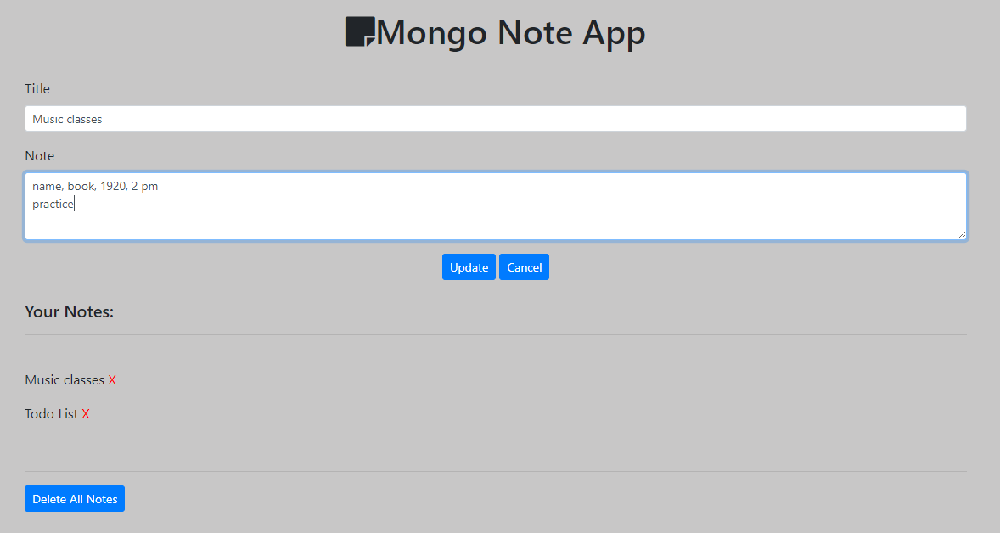

# Note-App-Mongo

Note Taker App

## Technologies Used
MongoDB, Node.js

### Function

* Create
* Edit
* Delete

## To Install

* Download and Insall Mongodb
* Git Clone the repository
* Navigate to the folder where the repository exists using Git Bash or Terminal
* Run the command `npm install` to download the required dependencies
* Then run the command `node server.js` to run the program

## Screenshot
* Main Page

  

* Edit Page

  

 

